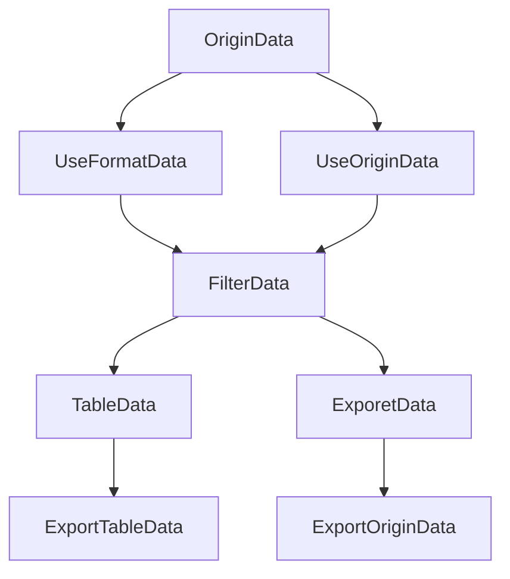

# 导入导出规则

### 涉及到的组件

- Filter
- Table
- Import
- Export
- OriginData
- UseData

这里面主要涉及到问题如下：

### 原始数据 到 展示数据的数据处理应该在哪一步做？

OriginData，作为初始数据源，不应该发生变化。

useData为页面的数据，理应在这做，但是由于useData很大情况下是根据OriginData和Filter同时产生的，而Filter又是经常变化的，在耗时较大的Format的时候，会损耗性能。

如果在Table里面进行计算的话，那么导出功能就获取不到格式化后的数据了。

Filter不涉及导入导出，Filter操作的应该是原始数据。

所以综上所述：

应该根据OriginData 生成 两个变量，一个UseOriginData，一个UseFormatData。

这样的话，获取数据后，格式化只做一次。

useData 由 UseFormatData在 FilterCondition过滤后产生，可直接作用于Table. 也可用来导出表格数据。

exportData 由 UseFormatData 在 FilterCondition过滤后产生。可用来做导出原始数据。

FilterData可直接读取UseFormatData的数据。

### 客户在导出数据的时候到底想导出什么数据？

客户导出的时候，大概率是想看表格里展示的数据，也就是规则化后的数据。

但是在极小的情况下是应该要导出原始数据的，例如导出配置页面的数据，做配置迁移等。

### 在有导入功能的情况下是否支持导出的数据能够直接导入？

在导出原始数据的情况下，尽量做到导出的数据支持导入。例如配置，mo等。
